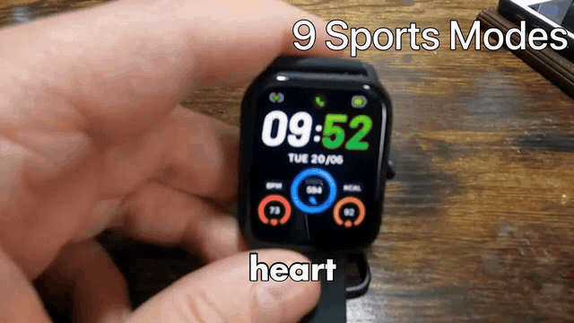

# Shear

**A fully autonomous video production pipeline** — Shear discovers a trending tech product, writes and narrates a review script, gathers and filters b-roll footage with computer-vision models, edits a complete video with subtitles and motion graphics, designs a thumbnail, and publishes the result to YouTube. End to end, with zero human input.

<p align="center">
  
</p>
<p align="center"><em>Six seconds of raw pipeline output — the b-roll selection, cut timing, animated spec overlays, and word-level subtitles are all machine-generated.</em></p>

Built in Python, deployed as a container on Google Cloud Run.

---

## What it does

One run of the pipeline produces one finished, published YouTube video:

```
Product discovery ─► Script writing ─► Voiceover (TTS)
        │                                    │
        ▼                                    ▼
  B-roll fetching ──► CV relevance filter ──► Video assembly
                                             (subtitles, overlays, SFX)
        │                                    │
        ▼                                    ▼
  AI thumbnail  ◄──── metadata generation ──► YouTube upload
```

1. **Product discovery** — samples a weighted tech category (3D printers, mini PCs, dash cams, …), queries Google Shopping via SerpAPI, and picks a product that hasn't been covered before (deduplicated against a persistent history of used ASINs).
2. **Script + narration** — an LLM writes a structured review script from the product data; the script is chunked at sentence boundaries and synthesized to natural-sounding speech (Inworld / OpenAI TTS).
3. **Media gathering** — scrapes product images and downloads relevant b-roll video from the web (`yt-dlp`, Google Images/Shopping) in parallel.
4. **Computer-vision filtering** — every candidate clip and image is scored for relevance before it's allowed on screen, using an ensemble of vision models:
   - **CLIP** (`openai/clip-vit-base-patch32`) for semantic image–text similarity
   - **YOLOv8** for object detection
   - **Grounding DINO** for zero-shot, text-prompted object detection
5. **Editing + assembly** — MoviePy/FFmpeg composite the final 720p video: intro, per-segment b-roll timed to the narration, product/spec overlays, link cards, sound effects, and word-accurate subtitles transcribed with `faster-whisper`.
6. **Thumbnail + metadata** — generates a photorealistic thumbnail with Gemini image editing (with verification and retry logic), plus SEO-aware title, description, and tags.
7. **Publish** — uploads the video and thumbnail through the YouTube Data API (OAuth 2.0).

## Engineering highlights

- **Memory-constrained editing.** Video assembly originally held every clip in memory and crashed on cloud instances; it now lazy-loads clips per segment and aggressively releases models (`release_models()`) between stages, letting the whole pipeline fit in a modest Cloud Run container.
- **Parallel everything.** Independent stages — audio synthesis vs. media downloads, thumbnail vs. metadata generation — run concurrently with `ThreadPoolExecutor`, cutting wall-clock time per video substantially.
- **Cost engineering.** Iteratively profiled API spend and swapped expensive calls for cheaper equivalents: GPT image generation → Gemini image editing, LLM title generation → deterministic templates, and removal of redundant vision-API calls from the b-roll fetcher.
- **Reliability.** External API calls use retries with exponential backoff; downloaded media is validated (stream checks, size sanity) before entering the edit; malformed LLM JSON output is repaired with a tolerant parser.
- **Cloud-native deployment.** Docker image built by Cloud Build, pushed to Artifact Registry, run on Cloud Run; API keys resolved from Google Secret Manager in production and `.env` locally.

## Tech stack

| Layer | Tools |
|---|---|
| Language | Python 3.10 |
| LLMs / GenAI | OpenAI GPT-4.1, Google Gemini, Groq |
| Speech | Inworld TTS, OpenAI TTS, faster-whisper (transcription/subtitles) |
| Computer vision | PyTorch, CLIP, YOLOv8 (Ultralytics), Grounding DINO |
| Video/image | MoviePy, FFmpeg, OpenCV, Pillow |
| Data sources | SerpAPI (Google Shopping/Images), yt-dlp, BeautifulSoup |
| Publishing | YouTube Data API v3 (OAuth 2.0) |
| Infrastructure | Docker, Google Cloud Run, Cloud Build, Artifact Registry, Secret Manager |

## Project structure

```
main.py                    # pipeline orchestrator
utils/
├── core/                  # config, settings, LLM/TTS/media helpers, lazy model loading
├── media/                 # product discovery, audio, assembly, thumbnail, upload
├── media_fetcher/         # image/video/webpage downloaders and extractors
├── thumbnail/             # AI thumbnail designs, rendering, verification
├── visual/                # clip selection, subtitles, overlays, motion graphics
└── prompts/               # all LLM prompt templates
Dockerfile                 # container image (python:3.10-slim + ffmpeg)
cloudbuild.yaml            # Google Cloud Build config
```

## Running it

```bash
pip install -r requirements.txt
python main.py
```

Requires FFmpeg on the system and the following environment variables (via `.env` locally, or Secret Manager on Google Cloud):

```
SHEARS_OPENAI_API_KEY      # script, metadata, TTS
SHEARS_GEMINI_API_KEY      # thumbnail generation
SHEARS_SERPAPI_API_KEY     # product + image search
SHEARS_INWORLD_API_KEY     # voiceover TTS
SHEARS_GROQ_API_KEY        # fast LLM inference
```

YouTube publishing additionally needs an OAuth client (`client_secrets.json`) with the YouTube Data API enabled; the first run opens a browser flow and caches the token.

Or as a container:

```bash
docker build -t shear .
docker run --env-file .env shear
```

## Background

This project grew out of an earlier open-source codebase by other developers. I took it over in 2024 and have rebuilt it end to end to see whether modern LLMs and vision models could automate video creation with zero human input — the LLM scripting, computer-vision b-roll filtering, editing pipeline, thumbnail generation, and cloud deployment are my work. It has been my testbed for learning production ML plumbing: managing GPU/CPU memory, orchestrating a dozen external APIs, keeping per-video costs down, and shipping something that runs unattended in the cloud.

## Disclaimer

Videos produced by this pipeline participate in the Amazon Associates program; descriptions include affiliate links and the required disclosure. This repository is a personal project and is not affiliated with Amazon, Google, or YouTube.
